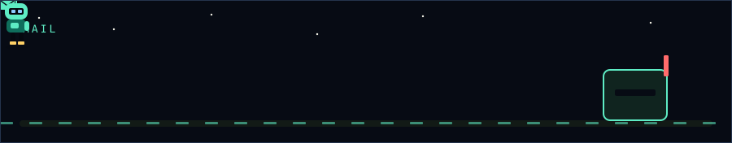
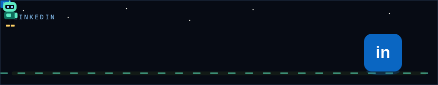

<picture><source media="(prefers-color-scheme: dark)" srcset="./assets/marquee-dark.svg"><source media="(prefers-color-scheme: light)" srcset="./assets/marquee-light.svg"></picture><a href="mailto:mahmoud.inquire@gmail.com"><picture><source media="(prefers-color-scheme: dark)" srcset="./assets/mail-dark.svg"><source media="(prefers-color-scheme: light)" srcset="./assets/mail-light.svg"></picture></a><a href="https://linkedin.com/in/mahmoudnabil-176"><picture><source media="(prefers-color-scheme: dark)" srcset="./assets/linkedin-dark.svg"><source media="(prefers-color-scheme: light)" srcset="./assets/linkedin-light.svg"></picture></a><picture><source media="(prefers-color-scheme: dark)" srcset="./assets/dance-dark.svg"><source media="(prefers-color-scheme: light)" srcset="./assets/dance-light.svg"></picture><picture><source media="(prefers-color-scheme: dark)" srcset="./assets/loadout-dark.svg"><source media="(prefers-color-scheme: light)" srcset="./assets/loadout-light.svg"></picture>

