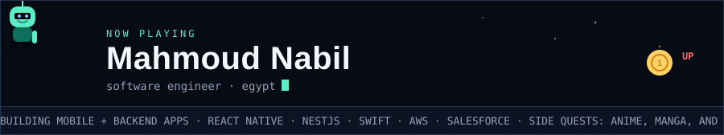
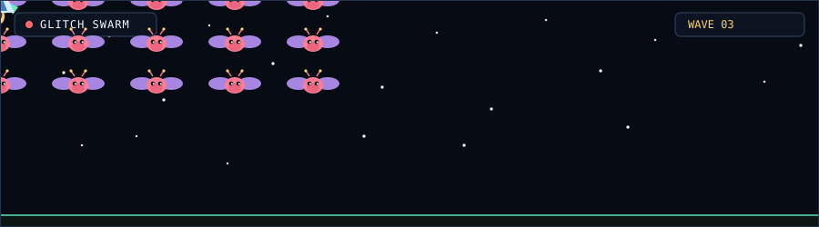

  <picture>
    <source media="(prefers-color-scheme: dark)" srcset="./assets/marquee-dark.svg">
    <source media="(prefers-color-scheme: light)" srcset="./assets/marquee-light.svg">
    
  </picture>

Attract mode for a software engineer who ships mobile and backend apps, then wanders off into side quests.

### Signal Runner

Night route through the city. Hop the bugs. Bank the commits.

  <picture>
    <source media="(prefers-color-scheme: dark)" srcset="./assets/runner-dark.svg">
    <source media="(prefers-color-scheme: light)" srcset="./assets/runner-light.svg">
    
  </picture>

### Glitch Swarm

A build went out with wings. Clear the board before it lands in production.

  <picture>
    <source media="(prefers-color-scheme: dark)" srcset="./assets/swarm-dark.svg">
    <source media="(prefers-color-scheme: light)" srcset="./assets/swarm-light.svg">
    
  </picture>

### Loadout

  <picture>
    <source media="(prefers-color-scheme: dark)" srcset="./assets/loadout-dark.svg">
    <source media="(prefers-color-scheme: light)" srcset="./assets/loadout-light.svg">
    
  </picture>

### Save file

- **Quest** — mobile and backend apps with React Native, NestJS, Swift, AWS, and Salesforce
- **Training** — system design, AWS, and native iOS
- **Co-op** — TypeScript, React Native, NestJS, Swift, Expo, and AWS
- **Side quests** — anime, manga, and small weird projects
- **Comms** — [mahmoud.inquire@gmail.com](mailto:mahmoud.inquire@gmail.com) · [LinkedIn](https://linkedin.com/in/mahmoudnabil-176) · [LeetCode](https://leetcode.com/bixtico)

Thanks for watching the attract mode.
